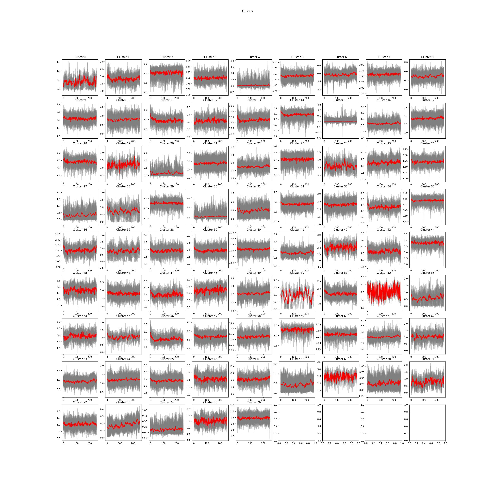
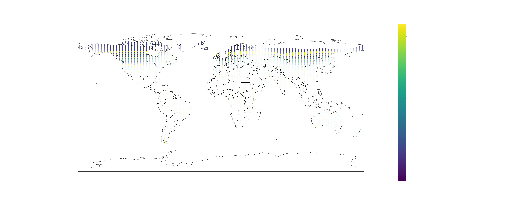

#  Data Science Project - Group 25
## Project name
Emulation of dynamic simulation models of vegetation growth
## Background Information
* Most of the plant growth simulation has ultra-high time and space consumption.
* A surrogate model is a good replacement for those high consumption simulators.
* It is a challenge to design a surrogate model so that it performs as well as the original scientific model while remaining computationally efficient remains.
## Expected Outcomes
* Short time-stamp prediction of NPP.
* Simulated data (NPP)’s whole time-series emulation process with multiple period prediction.
## Folder Description 
* **ARIMA_models**: ARIMA models which are applies by the cluster.
* **ARIMA_summary**: Summaries of ARIMA models which includes the key parameters, estimator, standard error and p-value.
* **cluster_models**: main code which includes the process of data preprocessing, uilts, and models of cluster, ARIMA and LSTM.
* **LSTM_models**: LSTM models which are applies by the cluster.
* **LSTM_summary**:Summaries of LSTM models which includes the information of each layer.
* **Random_Forest**: Whole process for Random_forest with data preprocessing and modeling.
* **numpy**: Arrays or label which is for modeling or plotting.
* **plot**: Plots for summarizing and evaluation
## Client information:
### Prod Peter Rayner -- Project Manager
**Professor In Climate Science\
School of Geography, Earth and Atmospheric Sciences of University of Melbourne**
### Dr Jeremy Silver -- Program Supervisor
**Research Fellow In Data Science\
Mathematics and Statistics of University of Melbourne**
## Group information
- Yuze qu：[yuzeq1@student.unimelb.edu.au](mailto:yuzeq1@student.unimelb.edu.au)
- Zhili Chen (Emile)：[zhilic@student.unimelb.edu.au](mailto:zhilic@student.unimelb.edu.au)
- Zening Zhang (Nathan)： [zeningz@student.unimelb.edu.au](mailto:zeningz@student.unimelb.edu.au)
- Ziqian Wu (Randy)：[ziqianw2@student.unimelb.edu.au](mailto:ziqianw2@student.unimelb.edu.au)
- Jiachen Huo (Cassiel)：[jihuo@student.unimelb.edu.au](mailto:jihuo@student.unimelb.edu.au)

## MAST90106 - Project Part-1
### Presentation
* [Canva](https://www.canva.cn/design/DAFBCMwo31g/1Fq1tvp-h1svuryfYaXv3A/view?utm_content=DAFBCMwo31g&utm_campaign=designshare&utm_medium=link2&utm_source=sharebutton): https://www.canva.cn/design/DAFBCMwo31g/1Fq1tvp-h1svuryfYaXv3A/view?utm_content=DAFBCMwo31g&utm_campaign=designshare&utm_medium=link2&utm_source=sharebutton
### Report 
* [Overleaf](https://www.overleaf.com/read/zggqfftshbfb): https://www.overleaf.com/read/zggqfftshbfb
## MAST90107 - Project Part-2
### Presentation
* [Google doc](https://docs.google.com/presentation/d/1c67JZ0hg1SJYNk6pikyPvD__esQDJoaduzWXMD8hYZM/edit?usp=sharing): https://docs.google.com/presentation/d/1c67JZ0hg1SJYNk6pikyPvD__esQDJoaduzWXMD8hYZM/edit?usp=sharing
* [Youtube](https://www.youtube.com/watch?v=0DoxLSOES4Q): https://www.youtube.com/watch?v=0DoxLSOES4Q
### Report
* [Overleaf](https://www.overleaf.com/read/jhrgzvxymcjd): https://www.overleaf.com/read/jhrgzvxymcjd

***Keywords***— [JeDi-DGVM](https://bg.copernicus.org/articles/10/4137/2013/), [Surrogate Model](https://en.wikipedia.org/wiki/Surrogate_model#:~:text=A%20surrogate%20model%20is%20an,a%20function%20of%20design%20variables.), [Random Forest](https://link.springer.com/article/10.1007/s11749-016-0481-7), [Clustering](https://en.wikipedia.org/wiki/Cluster_analysis), [ARIMA](https://link.springer.com/chapter/10.1007/978-3-319-52452-8_3), [Long Short-Term Memory](https://link.springer.com/chapter/10.1007/978-3-642-24797-2_4)
## Clusters display

